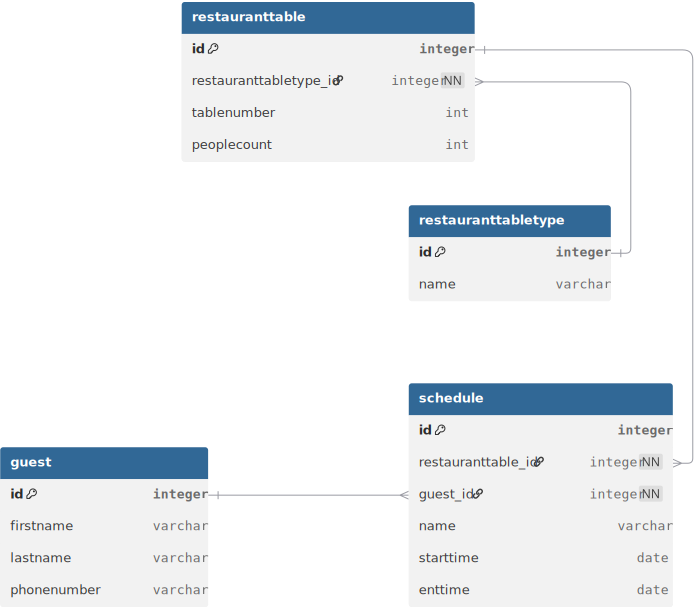
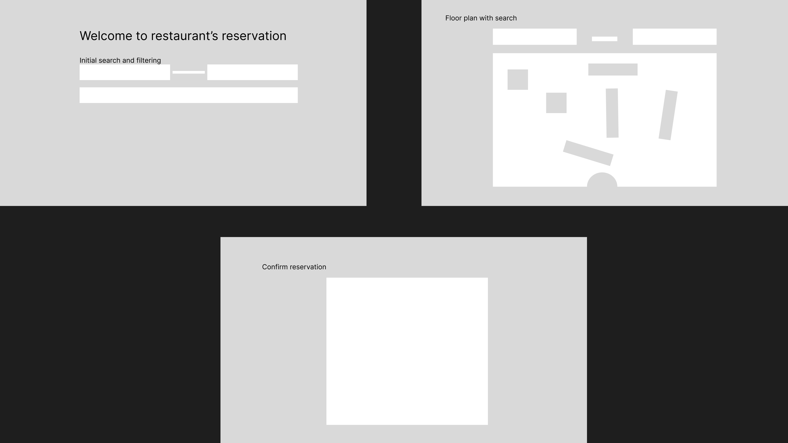

# Restaurant recommender
## Program setup
1. Install MySQL
   Download and install MySQL from mysql.com, version 8.0 or higher.
2. Open MySQL command line and run:
```
CREATE DATABASE restaurantweb_db;
```
3. Make sure the root password matches what's in application.properties:
```
spring.datasource.username=root
spring.datasource.password=yourpassword
```
If your password is different, they need to update application.properties to match their own MySQL credentials.
4. Install Java 25
   Download from jdk.java.net/25 and install it.
5. Run the app
   In the project folder open a terminal and run:
   .\gradlew bootRun
6. Open the browser and go to:
```
http://localhost:8080
```

## Basic requirements

- Filtering and search for booking
  - Floor plan or schedule
  - date and time
  - people count
  - zone
- Table recommending
  - After filtering and searching gives suitable tables
  - Recommended to show on the floor plan
- Visual plan
  - Occupied tables are seen visually
  - Wanted table is brought to attention

## Plan
1. Make ERD scheme - 03.03
2. Make database and connect entities to it - 08.03
3. Make empty structure - 08.03
4. Create buttons and controllers to navigate between pages - 08.03
5. Business logic
   6. Make new schedule. - 08.03
   7. Share the schedule ID between pages and fill specific schedule. - 08.03
   8. Table map implementation. - 08.03
      9. Making fixed map for demo.
   10. Add initial data for tables and types. - 08.03
   9. Add filter data. - 08.03
   10. Make tables interactive. - 08.03
   11. filter system and table highlights.
   11. Save the table selection.
   12. Show chosen information and ask for guest information.
   13. Confirm everything.
   14. Make ID in more secure form.
   15. Add better UI.
6. UI

## Entities
I made simple database entities for the project.


| Table           | Description                                   |
|-----------------|-----------------------------------------------|
| Guest           | Actual customer who wishes to book the table  |
| RestaurantTable | Available tables at the restaurant            |
| Schedule        | Shows each table time slots                   |
| Time            | Time slots for tables                         |

## File structure
### Controllers
Have navigation between web files and call out business logic.
### Entities
Has all the table structures associated with this project.
### Repositories
Has all the table interfaces to be able to manipulate data easier.
### resources/templates
Has all the html templates that give website structure and give the website its buttons and fields.
It allows me to refer to buttons and fields to update database based on input.
### static.css
It has all the css files that accompany html files to give more appealing UI.
### BLL
Business logic layer contains functions for controller to call out to accomplish actions. They are under BLL so the code in controller would not get too crowded, and it would not do too many things at the same time.
### resources/data.sql
Used for initial data to populate the tables for example.

## UI/UX visual sketch

1. Nice main page 
   2. initial information 
   3. enter time and date and customer count.
2. Table plan with available to see table placement and also has on top filter to choose table placement.
   3. See other tables.
   4. Have tables that fit lit up.
   5. Choose suitable table
6. Confirmation page
   7. Get guest information.
   8. Make sure all the information is correct.

## AI usage
- Gives me advice how to set up database and use springboot.
- Read errors for me

## Problems
1. Gradle runtime configuration for MySql. I can't find the right version -> solved by changing application.properties
   2. line spring.jpa.database-platform=org.hibernate.dialect.MySQLDialect, Claude helped me
2. Controller cannot find the html template. -> solved by adding thymeleaf and opening the app from gradle bootrun. Claude helped me

## Progress
1. Database is established with entities inside them.
2. Can add basic schedule with start and end date with time, can add people count.
3. Demo table map and filter dropdown
   4. Dropdown takes values from RestaurantTableType entity and makes sure they are unique.
5. Tables on the map are clickable and can see information about existing reservations.

## Missing functions
1. people count added to entities
2. final confirmation
3. Complete UI
4. Recommending functionality

Whole project took about 8 hours.

## Nice to haves to add in future
- Restaurant pick
- Many floors
- Restaurant owner able to change plans
- Menu recommendation
- Dynamic table connecting
- Average table occupation
- Automatic tests + docker